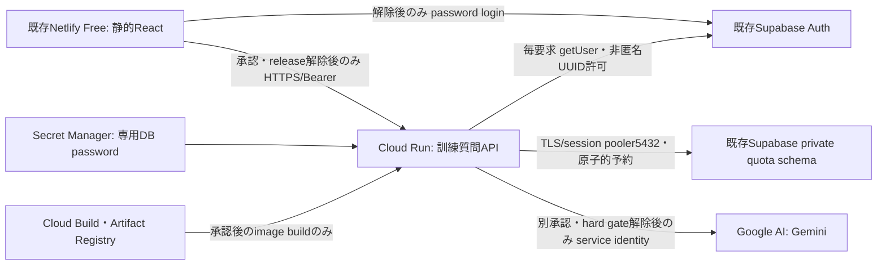

# LivingTown: Zenn Google Cloud Japan vol5 公開準備（2026-10-04）

現在は家族向けの**サンプル避難訓練**。東京固定10ノード11辺の計算は実際の避難経路の安全を保証しない。質問・経路比較・確認・根拠表示・3Dへの導線をローカルfakeで検証した。実Google AI、実Auth/共有DB、外部3D、コンテナを検証した成果ではない。

## 確認できた状態

| 項目 | 証拠と制約 |
|---|---|
| 対象大会 | [Zenn Google Cloud Japan vol5](https://zenn.dev/hackathons/google-cloud-japan-ai-hackathon-vol5)。古いWebMCP/Devpost記録は別大会の履歴 |
| Netlify | 利用者の現画面でFreeを確認。今回再取得していない。静的配信を維持、移行不要。アカウント固有の残枠や支払情報は公開しない |
| Supabase | 2026-10-04 read-only list_projects: 既存Livingtown / INACTIVE / ap-southeast-1。現在の契約・請求は未確認、復元なし |
| GCP | Project ID、請求先、既存資源、権限は未確認。クレジット登録は利用者画面で確認 |
| クレジット | 登録確認済み、11/18終了。Scope/SKUは未確定。残額・支払情報は公開しない。使用や追加支出を承認した意味ではない |
| 公開境界 | productionは環境設定を無視してサンプルDB・ブラウザー内模擬質問。Auth/共有DB/Cloud Run APIを新たに呼ばない。サーバーも実AI hard gateを維持 |

大会は10/15締切（このページでは時刻未確定）。Cloud Run等の対象GCP実行基盤と対象Google AIの利用、到達可能なアプリURL、説明・構成画像・約3分の自作YouTube動画、Zenn側のGitHub連携が必要。repositoryは公開/非公開とも可。提出した**default branchと稼働アプリを12/1まで維持**するため、11/18クレジット終了後の13日間を含めた費用・DB継続性が残る。現在のmockだけでは実AI要件を満たしたと扱わない。大会応募/提出、動画、他大会作品再利用の適格性は未確認。公務員参加許可は取得済み。

## 最小構成と境界

提出説明用の画像: [PNG](./assets/livingtown-zenn-architecture.png) / [原本SVG](./assets/livingtown-zenn-architecture.svg)。点線は未接続の計画で、実稼働の証拠ではない。



新規Cloud SQL/Firestore、VM、LB、VPC connector、OAuth、SA JSON配布は初期案に追加しない。メール＋パスワードは利用者選択済み、既存SDKを使用。サインアップ/メール配信依存なし。productionの`releasePolicy.ts`は**コードの解除とレビューが必要**で、Netlify envを設定するだけでは実接続しない。既存公開マップ/3Dの表示資源はこのAuth/DB/API lockとは別。ローカルDEVで実接続可能なコードもあるため、実資格や設定を入れる操作は承認後だけ。

認証セッションはタブ内メモリだけ。未認証・匿名・許可外を拒否し、callerのuserIdやメールを信用しない。中断/期限切れ/ログアウト/401で質問・確認・結果を失効し、遅延応答をrevisionで排除。LLMは4条件の質問順だけを返し、経路・住民票・住民確認を作成/代行しない。経路は利用者確認後に既存の決定的計算で求め、出典・データ更新時点・計算条件・未確認事項を示す。

利用上限は全体20回、利用者3回、出力256 tokens/回、1候補・1turn・自動retry0。private SQLは共通budget行ロックと台帳を一transactionで更新し、同request IDは409、失敗/中断/クラッシュも予約を返さない。自動リセットなし。SQLは**未適用**、PGliteで権限/保存再openを確認済みだが、実Postgres複数接続競合は未検証。CPU/通信/入力・思考tokens等も含む現金支出上限にはならない。`/healthz`はlivenessのみで実接続のreadinessを証明しない。

## モデルと費用の判断材料

[現行モデル寿命](https://docs.cloud.google.com/gemini-enterprise-agent-platform/models/model-versions)ではGemini 2.5系は10/20終了予定で、12/1維持用に採用しない。候補はGAの[`gemini-3.1-flash-lite`](https://docs.cloud.google.com/gemini-enterprise-agent-platform/models/gemini/3-1-flash-lite)、model location `global`（対応はglobal/us/eu）。Run region候補`asia-southeast1`は既存DBのSingaporeに合わせた案で、費用/速度の実測は未実施。モデルと実行regionは別の設定。

既存REST v1アダプターを維持し、Gemini3.1候補には`thinkingLevel: MINIMAL`、`includeThoughts: false`を送るmockテストを追加。Gemini3の[`thinkingBudget`は非推奨](https://docs.cloud.google.com/gemini-enterprise-agent-platform/models/thinking)。実AI transportはまだ配線せず、provider設定や`ALLOW_PAID_AI=true`でもruntime/HTTPが拒否する。service identity/ADCを前提にし、ブラウザー鍵やSA JSONを使わない。

| 費用項目 | 確認事項 |
|---|---|
| Gemini候補 | [標準online global価格](https://cloud.google.com/gemini-enterprise-agent-platform/generative-ai/pricing): text input $0.25/M、response+reasoning $1.50/M。20回×input1000/生成256 tokensと仮定すると約$0.01268。実tokens・追加thinking・為替・税・Scope適用は未検証で、請求額の保証ではない |
| Cloud Run | [request課金](https://cloud.google.com/run/pricing)、min0/max1、concurrency2、1CPU/512MiBから実測する候補。無料枠は請求先全体共有、CPU180k秒/RAM360kGiB秒/2M requests（月、us-central1換算）。外向き転送とregion差は別。max instancesも支出停止ではない |
| Supabase | [Free $0](https://supabase.com/pricing)のDB500MB/50kMAU/egress5GB等。低活動7日でpauseされ得るので12/1稼働保証なし。[少量のアクセスでもpauseの可能性](https://supabase.com/docs/guides/platform/free-project-pausing)。Proは$25/月から、1Micro相当compute credit $10含む。新規Proは未承認、GCP coupon対象外。2請求期間なら基本料だけ$50の例で、既存契約/日割り/追加使用量未確認 |
| Secret Manager | [6 active versions・10k accesses/月の無料枠](https://cloud.google.com/secret-manager/pricing)、超過$0.06/version/月・$0.03/10k accesses。既存請求先の消費も合算 |
| Artifact Registry | [0.5GiB無料、その後$0.10/GiB/月程度](https://cloud.google.com/artifact-registry/pricing)、image保持数と転送を確認 |
| Cloud Build | [適格machine/accountで2500無料build分/月](https://cloud.google.com/build/pricing)。source uploadのCloud Storage bucket、buildログのCloud Logging、保管/転送の費用も別途確認 |
| Netlify | 既存Free staticを維持。新しい有料契約/移行は不要。ビルド・request・bandwidth credit消費は今後の画面で照合する |

[Budget通知](https://docs.cloud.google.com/billing/docs/how-to/budgets)だけでは支出は止まらない。別機能のspend-cap budgetsは対象Scope/SKU/遅延を確認する必要があり、今回設定なし。coupon/無料枠を費用ゼロの保証にしない。承認済みcash上限を超えそうならアプリ利用受付を停止する運用と請求監視も必要。

## 承認後の外部設定手順（今回は未実行）

1. **GCP請求の確認:** project ID/請求先、coupon Scope/SKU、他サービス消費、11/18以降12/1までのcash上限を確定。リージョン/モデルを決め、必要なAPIと各資源だけ承認して作る。
2. **Supabase:** 現契約とpause/再開条件を確認して再開。テスト用非匿名password account・UUIDを決め、signup公開不要、JWT期間/レート制限を検証。DB管理者がSQL案をmigrationとしてレビューしてprivate quota schemaと専用`training_executor`を適用。既存データ変更/予算resetを行わない。IPv4 [session pooler](https://supabase.com/docs/guides/platform/ipv4-address)5432の画面のhost/userを使用（user `training_executor.<project-ref>`）。6543 transaction modeは未対応。TLSを無効にしない。別接続/別instanceで重複・総数・timeout・再起動試験。
3. **Google Cloud ID/秘密:** runtime IDとbuild IDを分離し、既存承認済みIDがあれば再利用可否を確認。runtimeは対象DB password secretにだけ`roles/secretmanager.secretAccessor`、fake時はVertex権限不要。AIを使う段階に限り`aiplatform.endpoints.predict`を含む必要最小権限を公式仕様で確認。Owner/EditorやSA JSONは不要。
4. **Build権限:** build IDに対象Artifact Registry repositoryの`roles/artifactregistry.writer`、必要なsource bucketだけ`roles/storage.objectViewer`、Cloud Logging出力の`roles/logging.logWriter`。build実行担当は必要なCloud Build実行権限とbuild IDへの`roles/iam.serviceAccountUser`。自動デプロイ権限をbuild IDへ付けない。[user-specified build ID手順](https://docs.cloud.google.com/build/docs/securing-builds/configure-user-specified-service-accounts)参照。
5. **Build:** 下記offline planを埋めてlint。`.gcloudignore`はserver runtime/依存/build recipe/LICENSEだけをuploadするallowlist、`.dockerignore`もsecret/log/画像/クライアントを除外。`server/cloudbuild.json`はroot contextから`server/Dockerfile`を1回buildしてimageを登録するだけ。対象image URIの`_IMAGE_URI`と承認済みbuild IDを明示してCloud Buildを実行する（例は下記、現在実行禁止）。image digestを固定して確認。
6. **Cloud Run fakeから:** デプロイ担当の対象Run作成/更新権限（`roles/run.developer`等を必要scopeに限定）、runtime IDへの`roles/iam.serviceAccountUser`、対象imageへの必要な読取権限を確認。初めはIAM非公開、設定は`server/.env.example`参照。provider fake、security verified、実接続承認時だけ`TRAINING_ALLOW_EXTERNAL_IO=true`。DB passwordはSecret Manager version指定から注入し、envファイル/CLI値/フロントへ出さない。[Run service identity](https://docs.cloud.google.com/run/docs/securing/service-identity)、[deploy手順](https://docs.cloud.google.com/run/docs/deploying)参照。
7. **Auth/API/公開:** fake providerの実Auth/DB/quotaを小人数で検証。Netlify browserからはSupabase BearerとRun IAM認証が異なるため、CORSだけではIAM非公開にアクセスできない。RunのHTTP公開（`run.services.setIamPolicy`/invoker設定）には別の公開・権限承認が必要。公開してもアプリ認証/上限必須。CORS完全一致`https://livingtown-webmcp.netlify.app`、POST/Authorization/Content-Type、cookie不要、wildcard禁止。Originなしも認証する。
8. **releaseとAI:** frontend production lockとbackend実AI lock解除・固定transport配線の小差分を別レビュー。Netlifyには承認済みAuth origin/public key/API originだけ、共有DBは必要性と公開データ範囲を別確認。service_role、DB password、session、SA鍵を設定しない。少量の実AI応答・tokens/請求・設定不足/不正入力/中断/再試行を実測してから公開版を確定。現在のmergeだけでは接続が有効にならない。
9. **提出維持:** 再利用適格性を主催者へ確認し、Zenn参加/プロジェクト/GitHub連携、URL・構成画像・YouTube動画・説明を確認。default branchの提出状態と審査用password account/sampleを12/1まで維持する。passwordをpublic PR/docsへ掲載しない。

```sh
# LOCAL ONLY: template has no credentials, network calls or authority to deploy.
cp server/deployment-plan.example.json server/deployment-plan.local.json
# Fill metadata/references, NEVER secret values. Local plan is gitignored.
node server/deployment-preflight.mjs server/deployment-plan.local.json
# Even valid syntax returns ready_to_deploy=false / live_ai_enabled=false.

# FUTURE APPROVED OPERATION ONLY; placeholders are not real project resources.
# gcloud builds submit . --project=PROJECT_ID --config=server/cloudbuild.json \
#   --service-account=projects/PROJECT_ID/serviceAccounts/BUILD_ID \
#   --substitutions=_IMAGE_URI=REGION-docker.pkg.dev/PROJECT_ID/REPOSITORY/livingtown-api:REVIEWED_SHA
```

## 再現と検証の限界

最終ローカル検証と独立レビュー指摘対応: [ZENN_VOL5_LOCAL_GATE_2026-10-04.md](./evidence/ZENN_VOL5_LOCAL_GATE_2026-10-04.md)。

通常起動/ログインfakeは [NETLIFY_CLOUD_RUN_PREPARATION.md](./NETLIFY_CLOUD_RUN_PREPARATION.md)。`npm ci`、`npm ci --prefix server --ignore-scripts`、`npm run typecheck`、`npm test`、`npm run test:assistant`、`npm run build`。新規backend testsはpreflightの秘密非出力、offline liveness/400、cloud設定不足/有料設定でもlisten前拒否、upload/build静的安全性を検証する。`.gcloudignore`はgitignore互換ルールの静的確認で、実gcloud uploadの試験ではない。

production lock browser試験はsynthetic inherited envでbuildし、`npm run preview -- --host 127.0.0.1 --port 4184`後に`node artifacts/interaction-comparison/release-lock-smoke.mjs`。1440/390px、queryのlocal overrideなしでsample flow、条件未確認の計算禁止、二重送信、根拠表示、Auth/DB/API要求ゼロを検証。外部map資源は遮断。正式iPhone実機/実GoogleAI/実DBを試験した証拠ではない。

実Postgres、gcloudは現環境に未設置。Docker取得のアクセス拒否を再試行/迂回しないのでcontainer build未検証。実AIの品質・遅延・入力/思考token総額、Run冷起動、Auth5秒+quota5秒+AI15秒とbrowser20秒timeoutの総合挙動は接続後に計測（timeoutでも予約は戻さない）。CIはunit/backend/build、Netlifyは既存静的自動配信のみ。新規クラウド設定/有料API/DB復元は行っていない。

## 次に必要な一括判断

GCP project/請求先とcoupon Scope、12/1までのcash上限（0円なら実接続を保留）、既存Supabaseの契約/復元/password test account/専用quota適用、モデル3.1候補global/Run Singapore案、Run公開とrelease解除、Zenn提出・再利用可否をまとめて確認する。金額や権限が不明なまま無料と扱わない。
